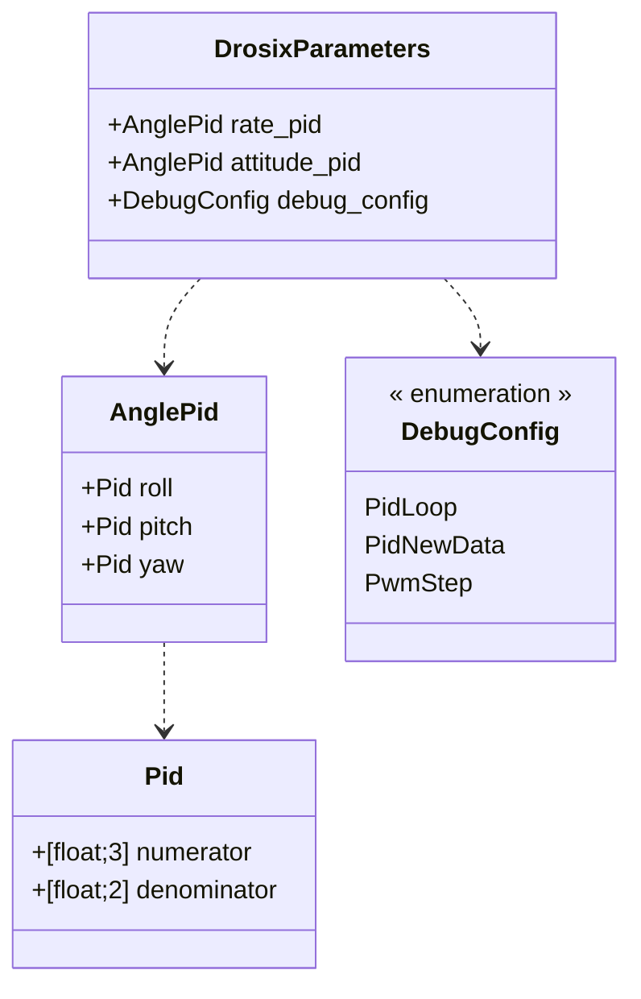

# Drosix Parameters

Drosix uses a TOML file to store the different parameters.

```mermaid
classDiagram
    class DrosixParameters {
        +AnglePid rate_pid   
        +AnglePid attitude_pid   
        +DebugConfig debug_config
    }

    class AnglePid {
        +Pid roll
        +Pid pitch
        +Pid yaw
    }

    class Pid {
        +[float;3] numerator
        +[float;2] denominator
    }

    class DebugConfig {
        << enumeration >>
        PidLoop
        PidNewData
        PwmStep
    }
    DrosixParameters..>AnglePid
    DrosixParameters..>DebugConfig
    AnglePid..>Pid
```
