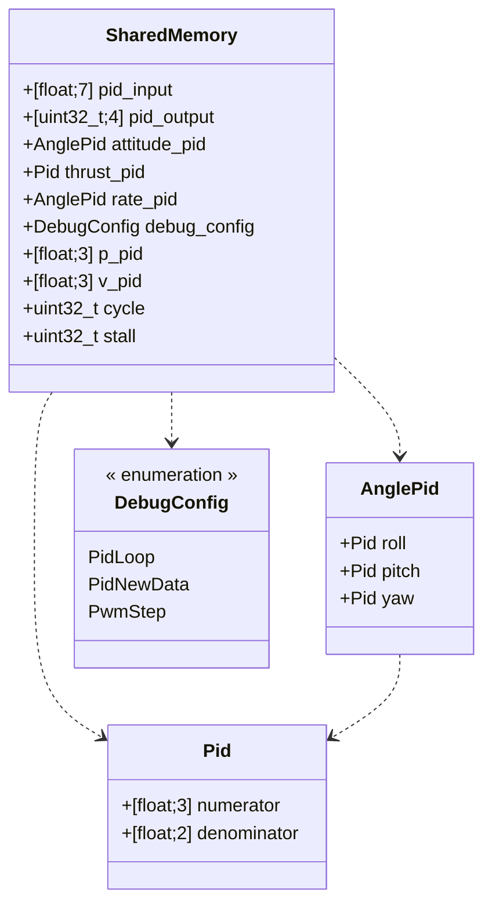
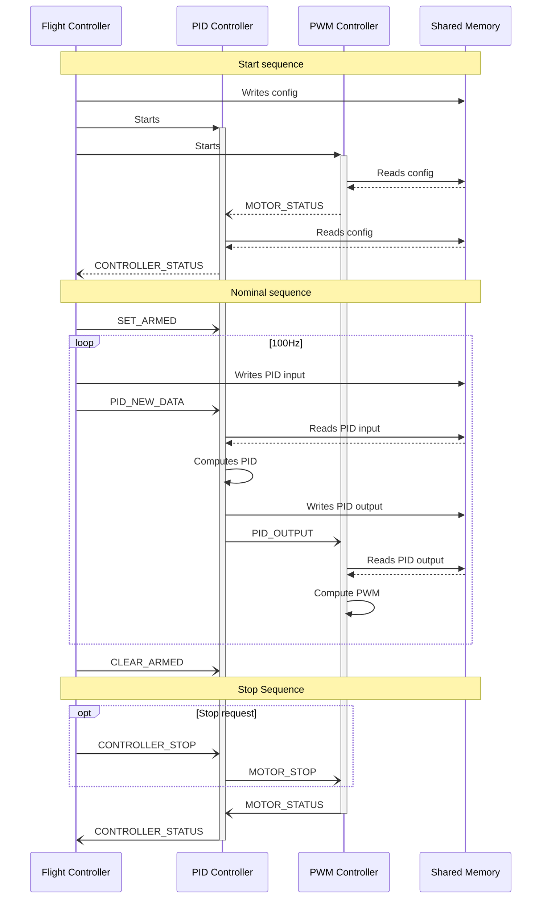

# PRU interfaces

The flight controller is responsible for the PRU subsystems.
The flight controller and the PRUs communicates through interrupt events and shared memory.

## Interrupt mapping

| Event             | From        | To    | Code        | Channel |
|:------------------|:------------|:------|:------------|:--------|
| MOTOR_STOP        | PRU0        | PRU1  | MST0 (S16)  | 1       |
| CONTROLLER_STOP   | HOST        | PRU0  | MST1 (S17)  | 0       |
| PID_NEW_DATA      | HOST        | PRU0  | MST2 (S18)  | 0       |
| CONTROLLER_STATUS | PRU0        | HOST0 | MST3 (S19)  | 2       |
| MOTOR_STATUS      | PRU1        | PRU0  | MST4 (S20)  | 0       |
| PID_OUTPUT        | PRU0        | PRU1  | MST5 (S21)  | 1       |
| SET_ARMED         | HOST        | PRU0  | MST6 (S22)  | 0       |
| CLEAR_ARMED       | HOST        | PRU0  | MST7 (S23)  | 0       |
| DEBUG             | PRU0 / PRU1 | HOST1 | MST15 (S31) | 3       |

## Shared memory layout

- [ ] Use named fields instead of anonymous arrays

## PRU subsystems communication sequences

