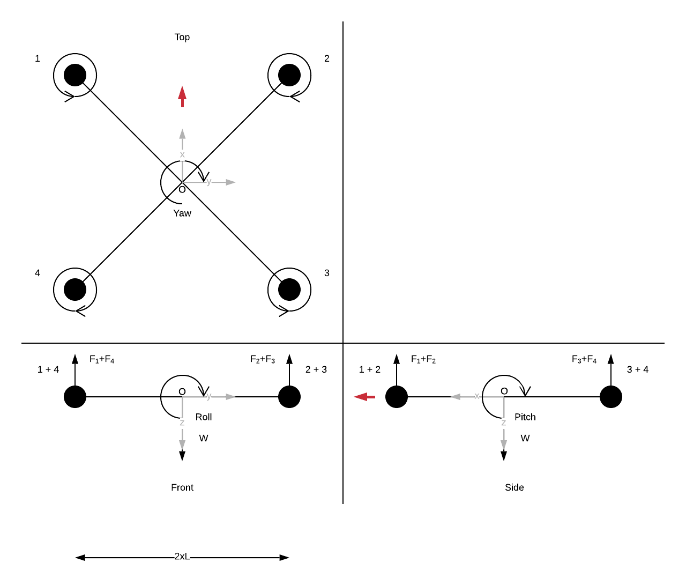

# Drosix control model

## Propulsion

A quadcopter is built with four system of propulsion. The propulsion system is
composed of a motor and a propeller mounted on it. Here we consider a propulsion
system composed of a BLDC motor and a two blades propeller. Each propulsion
group produces a thrust \\(T)\\ [N] and a moment \\(M\\) [N.m] such as:

\\[\begin{aligned}
T = C_T (\frac{N}{60})^2 D_{p}^4 \\\\
M = C_M (\frac{N}{60})^2 D_{p}^5
\end{aligned}\\]

where \\(N\\) represents the propeller speed [RPM], \\(D_p\\) is the propeller
diameter [m] and \\(C_M\\) and \\(C_T\\) are the thrust and moment coefficients.
\\(C_M\\) and \\(C_T\\) are presented in [1], They also can be approximated by
[flyeval](flyevak.com) website.

The propeller is directly mounted on the motor so they spin at the same
speed. In the case of a BLDC motor, the speed is controller by an electronic
speed controller (ESC). The ESC control the DC equivalent voltage applied to the
motor between [0-\\(U_{bat}\\)]V. The ESC input is \\(\sigma\\) such as:

\\[
U_{ESC} = \sigma U_{bat}
\\]

The motor is almost proportional to the input voltage. Only the mechanical mode
of the system is considered for the dynamic. This hypothese is made because the
electrical mode of the motor is much faster. Then the motor speed can be written
as:

\\[
\Omega_M = \frac{K_M}{T_M S + 1} \sigma
\\]

Actually, ESCs have a dead zone where \\(\sigma \neq 0\\) still provides
\\(V_{DC} = 0\\) V. For Drosix' current ESCs, the dead zone ends ar \\(\sigma
= 0.05\\). The relation between \\(\sigma\\) and \\(\Omega_M\\) can be adjusted:

\\[
\Omega_M = \frac{K_M}{T_M S + 1} (C_R \sigma + \omega_b)
\\]

## Body model

The body model is built under the assumption that the body is
rigid. Moreover, the mass and the moment of inertia of the body is constant over
the time. The center of gravity of drone is the same as the geometrical center
of the frame. Finally only the propulsion system thrust and the gravity forces
are applied to the body.

The drone attitude is the angular positions and velocities of the
frame. Newton's second law of motion for rotation is:

\\[
\sum{M_{\Delta i}} = J \dot{\omega}
\\]

Here \\(M_{\Delta i}\\) are the moment of the forces applied to the drone
against each axis. Supposing that the moment of inertia matrix is
\\[
J = 
\begin{bmatrix}
    J_x & 0   & 0   \\\\
    0   & J_y & 0   \\\\
    0   & 0   & J_z
\end{bmatrix}
\\]

Then, the relation which links the attitude velocity and the
propellers thrust and moment are:

\\[
\begin{aligned}
    J_x \dot{\omega_x} = d (T_1 - T_2 - T_3 + T_4) \\\\
    J_y \dot{\omega_y} = d (T_1 + T_2 - T_3 - T_4) \\\\
    J_z \dot{\omega_z} = M_1 - M_2 + M_3 - M_4
\end{aligned}
\\]
with \\(d\\) the distance between the motor and the center of the frame, \\(d
= \frac{\sqrt{2}}{2} L\\). The motor speed can be injected in the previous
equations such as:

\\[
\begin{bmatrix}
    J_x & 0   & 0   \\\\
    0   & J_y & 0   \\\\
    0   & 0   & J_z
\end{bmatrix}
\begin{bmatrix}
    \dot{\omega_x} \\\\
    \dot{\omega_y} \\\\
    \dot{\omega_z}
\end{bmatrix} =
\begin{bmatrix}
    dC_T & -dC_T & -dC_T & dC_T  \\\\
    dC_T & dC_T  & -dC_T & -dC_T \\\\
    C_M  & -C_M  & C_M   & -C_M
\end{bmatrix}
\begin{bmatrix}
    \omega_1^2 \\\\
    \omega_2^2 \\\\
    \omega_3^2 \\\\
    \omega_4^2
\end{bmatrix}
\\]

Moreover, the thrust along the \\(z\\) axis of the frame is:
\

\\[
f =
\begin{bmatrix}
    C_T & C_T & C_T & C_T
\end{bmatrix}
\begin{bmatrix}
    \omega_1^2 \\\\
    \omega_2^2 \\\\
    \omega_3^2 \\\\
    \omega_4^2
\end{bmatrix}
\\]

The system can be expressed under the space state representation:

\\[
\begin{aligned}
\dot{x} = A x + B u \\\\
y = C x + D u
\end{aligned}
\\]

The angular position is \\(\dot{\theta} = \omega\\).

\\[
\begin{bmatrix}
    \dot{\theta_x} \\\\
    \dot{\theta_y} \\\\
    \dot{\theta_z} \\\\
    \dot{\omega_x} \\\\
    \dot{\omega_y} \\\\
    \dot{\omega_z}
\end{bmatrix} =
\begin{bmatrix}
    0 & 0 & 0 & 1 & 0 & 0 \\\\
    0 & 0 & 0 & 0 & 1 & 0 \\\\
    0 & 0 & 0 & 0 & 0 & 1 \\\\
    0 & 0 & 0 & 0 & 0 & 0 \\\\
    0 & 0 & 0 & 0 & 0 & 0 \\\\
    0 & 0 & 0 & 0 & 0 & 0 \\\\
\end{bmatrix}
\begin{bmatrix}
    \theta_x \\\\
    \theta_y \\\\
    \theta_z \\\\
    \omega_x \\\\
    \omega_y \\\\
    \omega_z
\end{bmatrix} + 
\begin{bmatrix}
    0       & 0         & 0         & 0         \\\\
    0       & 0         & 0         & 0         \\\\
    0       & 0         & 0         & 0         \\\\
    J_xdC_T & -J_xdC_T  & -J_xdC_T  & J_xdC_T   \\\\
    J_ydC_T & J_ydC_T   & -J_ydC_T  & -J_ydC_T  \\\\
    J_zC_M  & J_zC_M    & -J_zC_M   & -J_zC_M
\end{bmatrix}
\begin{bmatrix}
    \omega_1^2 \\\\
    \omega_2^2 \\\\
    \omega_3^2 \\\\
    \omega_4^2 \\\\
\end{bmatrix}
\\]

